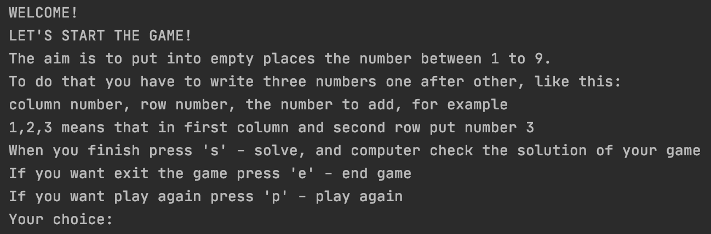
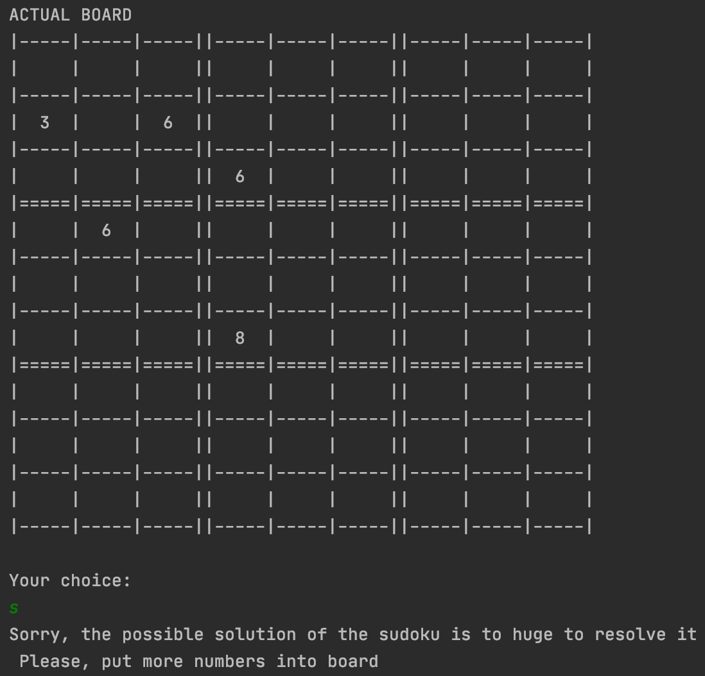

# SudokuGame
Application to solve sudoku game

## General Information
The program is resolving the popular game sudoku if it is possible.

## Screenshots and game description
The game is started with following information

Additionaly, you can put more than one sudoku element coordinates.

If you choose 's', there is three options:
* If you put less then 10 elements, the program will not start resolving. You will be asked to put more elements.

* If everything is ok, the program will resolved the sudoku and show the board before and after resolved.

* If the sudoku has already solved and you will try to resolve it again, the program will asked you to choose other option.

If you choose 'p', the program will start again with empty board.

If you choose 'e', the program will thank you for playing and swich off.

 
## Technologies
JAVA version 11.0.9
 
## Setup
Gradle -> Tasks -> application -> run
 
## Licence
Freeware
